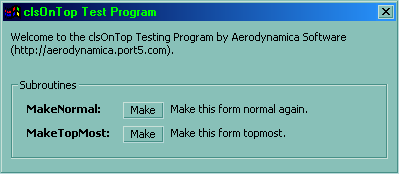



## Always On Top Class Module

### Description

This is a simple class module that wraps the Always On Top function to make your forms on top of others.
 
### More Info
 

             |
---                |---
**Submitted On**   |2000-10-19 08:03:40
**By**             |[Aaron Chan](https://github.com/Planet-Source-Code/PSCIndex/blob/master/ByAuthor/aaron-chan.md)
**Level**          |Intermediate
**User Rating**    |4.9 (201 globes from 41 users)
**Compatibility**  |VB 5\.0, VB 6\.0
**Category**       |[Miscellaneous](https://github.com/Planet-Source-Code/PSCIndex/blob/master/ByCategory/miscellaneous__1-1.md)
**World**          |[Visual Basic](https://github.com/Planet-Source-Code/PSCIndex/blob/master/ByWorld/visual-basic.md)
**Archive File**   |[CODE\_UPLOAD1077310192000\.zip](https://github.com/Planet-Source-Code/aaron-chan-always-on-top-class-module__1-12144/archive/master.zip)

